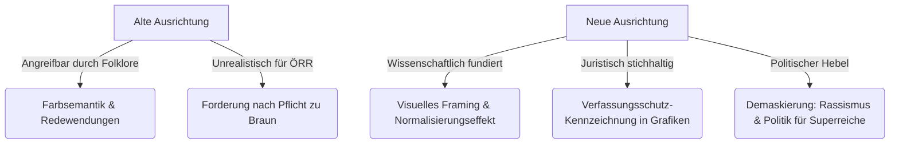

# Content-Optimierungsstrategie für „Rescue Blue“

**Dokumenttyp:** Strategischer Aktionsplan & Redaktioneller Leitfaden  
**Ziel:** Schärfung der Kampagnenargumentation, Beseitigung rhetorischer Schwachstellen (unter Berücksichtigung des Feedbacks von Fabian A.) und Fokussierung auf die Demaskierung von Rechtsextremismus und Sozialbetrug.

---

## 1. Ausgangslage & Strategiewechsel

### Das bisherige Dilemma
Die bisherige Konzeption von *Rescue Blue* konzentrierte sich stark auf die **ästhetisch-kulturelle Ebene**:
- *„Blau ist eine friedliche, schöne Farbe (siehe Redewendungen wie ‚Blau machen‘), die AfD beschmutzt sie, ARD/ZDF müssen die AfD braun färben.“*

Wie die Kritik von Fabian A. treffend aufzeigt, hat dieser Ansatz drei gravierende Schwächen:
1. **Linguistische Angreifbarkeit:** Redewendungen wie *„Blau machen“* (Faulenzen/Schwänzen) oder *„Blaues Auge“* (Körperverletzung) eignen sich denkbar schlecht, um die Erhabenheit der Farbe Blau zu belegen. Kritiker können das Projekt leicht als naiv oder „blauäugig“ ins Lächerliche ziehen.
2. **Medienrechtliche Sackgasse:** Der öffentlich-rechtliche Rundfunk (ÖRR) kann und darf aufgrund gesetzlicher Neutralitäts- und Kontinuitätsvorgaben (§ 26 Medienstaatsvertrag, BVerfG zur Chancengleichheit) Balkengrafiken nicht willkürlich braun einfärben. Ein Offener Brief mit dieser Maximalforderung wird von Chefredaktionen nicht ernst genommen.
3. **Verfehlen des Hauptziels:** Das eigentliche Ziel lautet: **Menschen vor Augen zu führen, dass die AfD eine gesichert rechtsextreme, rassistische Partei ist, die Umverteilung von unten nach oben zugunsten von Superreichen betreibt.** Dieser Kern ging in der Debatte um Farbpaletten und Sprichwörter verloren.

---

## 2. Die neue strategische Leitlinie: „Visuelle Verantwortung statt Farbdebatte“

Wir transformieren die Kampagne von einer scheinbaren „Farbenretter-Romantik“ zu einer **fundierten Initiative für mediale Einordnungspflicht und demokratische Aufklärung**:



---

## 3. Konkrete Maßnahmen nach Sektionen

### 3.1 Sektion „Farbsemantik & Kultur“ (CultureSection & `sayings` in `de.json`)

#### Bisheriger Stand (Fehlerhaft / Angreifbar):
- Nennung von *„Blau machen“*, *„Fahrt ins Blaue“* und *„Mit einem blauen Auge davonkommen“*.

#### Neuer Ansatz: „Politische Mimikry & Missbrauch demokratischer Symbole“
Die Sektion wird umgestellt auf die historische und kommunikationswissenschaftliche Einordnung:
- **Symbolik der Friedensordnung:** Wie Blau zur Erkennungsfarbe der Nachkriegsordnung, der Vereinten Nationen (Blauhelme) und der Europäischen Einigung (Europaflagge) wurde.
- **Strategische Mimikry (Tarnung):** Wie extremistische Kräfte gezielt etablierte bürgerliche Codes kapern, um einen Eindruck von Biederkeit und Bürgerlichkeit zu erwecken (historische Parallele: Aneignung nationaler oder sozialer Begriffe durch radikale Ränder).
- **Das Paradoxon:** Warum eine anti-europäische, nationalistische Partei ausgerechnet in der Farbe des europäischen Friedensprojekts auftritt.

---

### 3.2 Sektion „Offener Brief“ (OpenLetterSection & `openLetters`)

#### Bisheriger Stand:
- Geforderter Eingriff in Balkenfarben (Forderung, AfD in Grafiken braun zu färben).

#### Neuer Ansatz: „Kontextualisierung & Kennzeichnungspflicht“
Forderung an Chefredaktionen von ARD, ZDF und privaten Medien:
1. **Keine visuelle Gleichmacherei:** In Wahldiagrammen und Infokästen muss transparent gemacht werden, wenn ein Landesverband oder eine Gruppierung von Sicherheitsbehörden als *gesichert rechtsextremistisch* eingestuft ist (z. B. durch optische Kennzeichnung / Asterisk mit Behördennachweis).
2. **Kritische Distanz bei Studiobildern:** Keine unkommentierte Übernahme von Wahlkampf-Slogans oder verharmlosenden Parteidesigns in der redaktionellen Berichterstattung.
3. **Kontext vor Balken-Ästhetik:** Verpflichtung, Zahlenwerte immer mit den verfassungsrechtlichen Einordnungen des Verfassungsschutzes und den Urteilen der Obergerichte (OVG Münster) zu verknüpfen.

---

### 3.3 Sektion „Politische Risiken & Realität“ (PolicyDangersSection)

Diese Sektion ist der **wirkungsvollste Hebel der gesamten Seite** und muss an oberste Stelle im Argumentationsstrang rücken:

1. **Top-Thema: „Das AfD-Paradox – Politik für Superreiche“ (DIW Berlin)**
   - Herausstellen, dass die Steuerpläne der AfD Multimillionäre entlasten und Geringverdiener belasten.
   - Aufzeigen des Stimmverhaltens gegen Mindestlohn, gegen Tariftreue und für Bürgergeld-Zwangsarbeit.
2. **Thema 2: „Der völkische Rassismus & Potsdam“**
   - Klarer Verweis auf das BVerfG-Urteil zum ethnischen Volksbegriff (Verletzung von Art. 1 GG).
   - Dokumentation der „Remigrations“-Pläne gegen deutsche Staatsbürger.
3. **Thema 3: „Rechtsextremismus & SA-Parolen vor Gericht“**
   - Urteil des OVG Münster vom 13. Mai 2024 (Verdachtsfall bestätigt).
   - Gerichtliche Einstufung der Landesverbände Thüringen, Sachsen und Sachsen-Anhalt als gesichert rechtsextremistisch.
   - Höcke-Verurteilungen wegen SA-Parolen durch das Landgericht Halle (2024).

---

## 4. Konkrete Textvorschläge für `src/i18n/locales/de.json`

### A. Ersatz für `sayings.sprache`:
```json
"sprache": [
  {
    "phrase": "Die Strategie der visuellen Mimikry",
    "origin": "Kommunikationswissenschaftliche Analyse",
    "desc": "Rechtsextreme Bewegungen eignen sich gezielt bürgerliche, beruhigende Farbcodes an, um das eigene radikale Erscheinungsbild zu glätten und gesellschaftliche Akzeptanz in bürgerlichen Milieus zu simulieren."
  },
  {
    "phrase": "Der Kontrast zur Europa-Farbe",
    "origin": "Europäische Nachkriegsordnung",
    "desc": "Während das europäische Blau für Rechtsstaatlichkeit, Völkerverständigung und offene Grenzen steht, nutzt eine nationalistische Partei dieselbe Farbe zur Propagierung von Abschottung und 'Dexit'."
  },
  {
    "phrase": "Biederkeit als Camouflage",
    "origin": "Extremismusforschung",
    "desc": "Hinter einer formal seriösen Außendarstellung verbirgt sich eine Programmatik, die gerichtlich bestätigt gegen die Menschenwürde und den Gleichheitsgrundsatz unseres Grundgesetzes gerichtet ist."
  }
]
```

### B. Überarbeitung von `science.foundations[1].points[1]` (Etablierte Farbkonventionen):
```json
{
  "label": "Verantwortungsvolle Einordnung",
  "text": "Medien sind nicht zur PR-Multiplikation verpflichtet. Journalistische Sorgfalt erfordert, dass die Berichterstattung über verfassungsfeindliche Bestrebungen nicht durch verharmlosende Designroutinen nivelliert wird. Kennzeichnungspflichten und kontextualisierende Fußnoten sind etablierte redaktionelle Standards."
}
```

---

## 5. Fazit

Mit diesen Anpassungen entkräften wir die berechtigten Kritikpunkte von Fabian A. vollständig:
- Die unpassenden Redewendungen verschwinden.
- Die Medienforderungen werden juristisch und publizistisch wasserdicht.
- Das eigentliche Hauptziel des Nutzers – **die unmissverständliche, faktenbasierte Demaskierung der AfD als rechtsextreme, rassistische und unsoziale Partei** – wird ins uneingeschränkte Zentrum gerückt.
